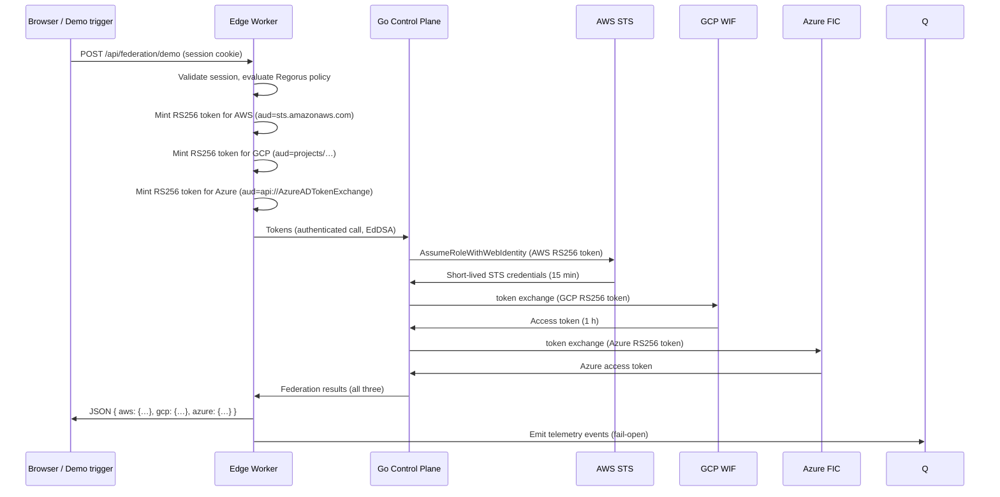
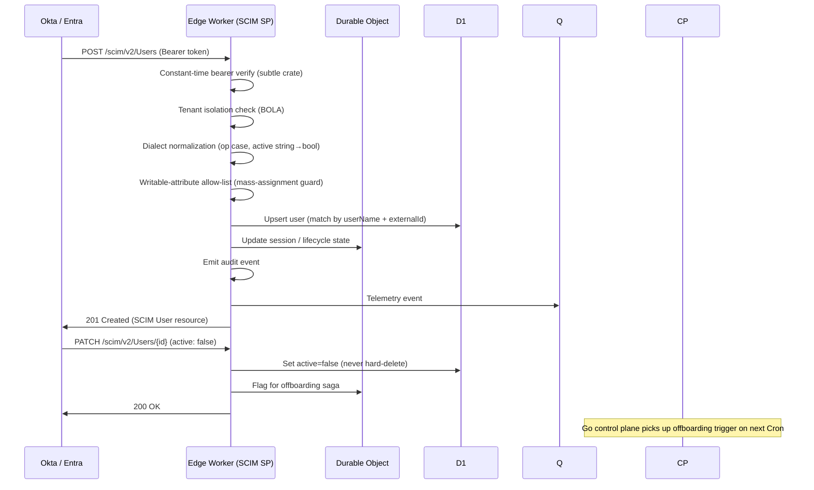

# Tessera — Architecture

This document describes the architecture of Tessera in depth: the six layers, the keyless federation model, Cloudflare resource map, component responsibilities and boundaries, and the data flows and trust model that hold everything together.

---

## Table of Contents

1. [System overview](#1-system-overview)
2. [Layer 1 — Edge Identity Engine (Rust/WASM)](#2-layer-1--edge-identity-engine-rustwasm)
3. [Layer 2 — Policy-as-Code (OPA / Rego v1 + Regorus)](#3-layer-2--policy-as-code-opa--rego-v1--regorus)
4. [Layer 3 — Control Plane (native Go)](#4-layer-3--control-plane-native-go)
5. [Layer 4 — Multi-cloud Federation (Terraform + CDK)](#5-layer-4--multi-cloud-federation-terraform--cdk)
6. [Layer 5 — Site + Live 3D (Astro + R3F)](#6-layer-5--site--live-3d-astro--r3f)
7. [Layer 6 — CI/CD (hardened GitHub Actions)](#7-layer-6--cicd-hardened-github-actions)
8. [Cloudflare resource map](#8-cloudflare-resource-map)
9. [Dual-algorithm rationale](#9-dual-algorithm-rationale)
10. [Keyless federation insight](#10-keyless-federation-insight)
11. [Trust boundaries and data flow](#11-trust-boundaries-and-data-flow)
12. [Sequence diagrams](#12-sequence-diagrams)
13. [Scaling and limits](#13-scaling-and-limits)

---

## 1. System overview

Tessera is composed of six interdependent layers deployed entirely on Cloudflare (edge + storage + pages), orchestrated by a native Go control plane that runs as scheduled GitHub Actions workflows. All cloud infrastructure is ephemeral and provisioned keylessly from CI.

```
                    ┌─────────────────────────────────────────────┐
                    │      Cloudflare Pages — Astro + R3F site     │
                    │  light premium UI · live 3D flow graph (SSE) │
                    │  static-first; lazy capability-gated island  │
                    └───────────────▲──────────────┬──────────────┘
                                    │ SSE telemetry │ trigger demo
IdP: Okta / Entra    OIDC (PKCE)   │               ▼
(+ built-in mock, ──────────────▶  ┌┴───────────────────────────────┐
 SAML via broker)  SCIM push ────▶ │  Edge Identity Engine (Rust/WASM)│
                                   │  • OIDC RP (PKCE, iss-param)     │
                                   │  • OIDC IdP (dual-alg JWKS)      │
                                   │  • OAuth 2.1 / introspect / DPoP │
                                   │  • SCIM 2.0 service provider     │
                                   │  • Regorus (Rego v1) authz  ◀───┼── signed bundle (R2)
                                   │  • opaque sessions (Durable Obj) │
                                   └──┬───────────────┬──────────────┘
                     phase-transition │               │ RS256 token (per cloud)
                       ┌─────────────▼──┐             ▼
Native Go control plane│ Telemetry:     │   Multi-cloud federation
(GitHub Actions Cron + │ Queue → DO     │   AWS STS · GCP WIF · Azure FIC
 local), real cloud SDKs│ aggregator → SSE│
• JML state machines   └────────────────┘   Terraform (trust, 3 clouds)
• access-review campaigns                   + AWS CDK (access-review pipeline)
• offboarding saga                          all ephemeral, keyless OIDC in CI
• policy admin (signs/pushes R2 bundles)
• federation orchestration
── state: D1 · DO · KV · R2 (audit WORM + hash-chain) · Queues
```

---

## 2. Layer 1 — Edge Identity Engine (Rust/WASM)

The edge engine is a single Cloudflare Worker compiled from Rust to `wasm32-unknown-unknown` via `workers-rs`. It is the Protocol Enforcement Point (PEP) for the entire system — all identity decisions flow through it.

### Source modules

| Module | Responsibility |
|---|---|
| `rp.rs` | OIDC Relying Party: Authorization Code + PKCE (S256 mandatory, anti-downgrade), state/nonce, RFC 9207 `iss` response parameter, dual-IdP (Okta + Entra) mix-up defense |
| `discovery.rs` | OIDC IdP discovery: publishes `/.well-known/openid-configuration`, JWKS endpoint with dual-key ring (EdDSA + RS256) |
| `jwks.rs` | JWKS management, key rotation (overlapping `kid`s), KV-cached single-flight refresh, unknown `kid` refetch-once rate-limiting |
| `jwt.rs` | JWT validation: explicit alg allow-list, reject `alg:none`, one-key-one-alg enforcement, `iss`/`aud`/`exp`/`nbf` required, reject `jku`/`x5u`/`jwk` from token (SSRF) |
| `internal_token.rs` | EdDSA/Ed25519 signing for internal tokens (session binding, control-plane calls) |
| `webcrypto_rsa.rs` | RS256 signing via WebCrypto SubtleCrypto (avoids `rsa` crate Marvin timing issue and slow WASM keygen); `rsa` crate used for verification only |
| `federation.rs` | Mints per-cloud RS256 tokens with correct `aud` for AWS/GCP/Azure exchange |
| `dpop.rs` | DPoP (RFC 9449) proof verification for sender-constraining browser/SPA clients |
| `introspect.rs` | OAuth 2.1 token introspection (RFC 7662) with authenticated calls only |
| `session.rs` / `session_do.rs` | Opaque session token issuance + Durable Object session store (single-writer strong consistency, instant revocation) |
| `ssrf.rs` | SSRF allow-list enforcement on every issuer/JWKS fetch (blocks RFC 1918, metadata endpoints) |
| `fetcher.rs` | WASM-safe `fetch`-backed `AsyncHttpClient` for `oauth2` + `openidconnect` crates |
| `decision_log.rs` | Emits OPA-shaped decision log events from Rust host code (Regorus has no decision-log plugin) |
| `authz/` | Regorus engine instantiation, policy bundle load/verify from R2, per-request evaluation |
| `scim/` | Full SCIM 2.0 service provider (router, handlers, dialect normalization, D1 store, filter parser, patch engine) |

### SCIM dual-dialect

The SCIM service provider normalises differences between Okta and Entra before any business logic runs:

- `op` field compared case-insensitively (`Replace` = `replace`)
- `active` accepted as boolean and as string `"False"` (Entra legacy quirk)
- `replace` handled with and without `path` (dot-notation split)
- Group member removal accepted as value-array and as `members[value eq "…"]` filter
- `active:false` never hard-deletes (record remains GET-able)
- Zero-result lists return `200` empty `ListResponse` (never 404)
- `Content-Type: application/scim+json` always; TLS 1.2+

### Rust crate set (WASM-on-Workers verified)

| Crate | Version | Role |
|---|---|---|
| `worker` | 0.8 | Cloudflare bindings (KV/DO/R2/D1/Queues/Cron) |
| `jsonwebtoken` | 10.4 (`default-features=false`, `rust_crypto`) | JWT sign/verify, JWK, RFC 7638 thumbprint |
| `ed25519-dalek` | 2.2 | Pure-Rust Ed25519 sign/verify |
| `pasetors` | 0.7 (`v4`, `paserk`) | PASETO v4.local for optional stateless cross-Worker tokens |
| `oauth2` | 5.0 | OAuth 2.1 client flows |
| `openidconnect` | 4.0 | OIDC RP logic |
| `regorus` | 0.10 (`arc`, `regex`, `semver`, `graph`) | Pure-Rust Rego v1 evaluation |
| `subtle` | 2.6 | Constant-time equality (SCIM bearer verification) |
| `getrandom` | 0.3 (`wasm_js`) | CSPRNG on WASM (requires `RUSTFLAGS=--cfg getrandom_backend="wasm_js"`) |

Explicitly excluded: `ring`, `aws-lc-rs`, `openssl`, `josekit`, `samael`, `reqwest`.

---

## 3. Layer 2 — Policy-as-Code (OPA / Rego v1 + Regorus)

### Split architecture

Tessera uses OPA (the authoring + test + IaC-gate toolchain) together with Regorus (the in-process edge evaluator):

| Component | Tool | Why |
|---|---|---|
| Policy authoring | OPA + Rego v1 | Standard toolchain, `opa test`, Regal lint, conftest |
| Edge evaluation | Regorus 0.10 | Pure-Rust Rego, compiles to `wasm32`; OPA-compiled-WASM requires wasmtime (cannot nest in V8 Workers) |
| IaC guardrails | conftest | Evaluates Rego v1 deny rules against `terraform show -json` plan output |
| Policy distribution | R2 bundle | Signed versioned artifact; Worker verifies detached signature before load |

### Policy model

```rego
# RBAC-A: role sets the permission envelope; ABAC only narrows it
default allow := false

allow if {
    role_permits          # role→permission lookup in data
    all abac_constraints  # environment/resource attribute conditions
}
```

- Roles and bindings live in `data`; subject/resource/action/environment come from `input`
- SoD (Separation of Duty) matrix encoded as Rego; evaluated **preventively** (request-time) and **detectably** (review sweeps)
- Default-deny test is mandatory in every policy package's test suite
- `opa test --coverage` gates CI; Regal runs as a separate lint step

### Regorus conformance

Because Regorus is pre-1.0, every OPA test vector is also run through a Regorus conformance harness (`policy/conformance/`). The engine is pinned to an exact version; CI blocks on any vector divergence.

### Policy bundle distribution

OPA's native signed bundle format is incompatible with Regorus. Tessera ships a custom format:

1. Control plane (Go) versions and signs policy+data artifacts (detached JWT-over-SHA-256 of bundle bytes)
2. Signed bundle is written to R2 under a versioned key
3. Worker polls via R2 `ETag`/`If-None-Match`; on change, fetches bundle, verifies signature, and hot-loads into Regorus
4. Failed verification → fail-closed (request denied, alert emitted)

---

## 4. Layer 3 — Control Plane (native Go)

The control plane is native idiomatic Go (not TinyGo), running as scheduled GitHub Actions workflows and locally. It uses real AWS, Azure, and GCP SDKs — the reason it cannot run as a Cloudflare Worker.

### Package structure

| Package | Responsibility |
|---|---|
| `cmd/access-review/` | Access-review campaign runner |
| `cmd/offboard/` | Leaver saga executor |
| `internal/lifecycle/` | JML state machines (Joiner, Mover, Leaver) |
| `internal/review/` | Risk-tiered review campaign logic |
| `internal/offboard/` | Multi-step offboarding saga |
| `internal/federation/` | AWS STS, GCP WIF, Azure FIC token exchange |
| `internal/scim/` | SCIM reconciliation client |
| `internal/nhi/` | Non-human identity (service account) lifecycle |
| `internal/sod/` | Separation-of-duty enforcement sweeps |
| `internal/audit/` | Append-only R2 audit writer |
| `internal/domain/` | Domain model (identity, role, entitlement, review) |
| `internal/ports/` | Outbound port interfaces (cloud SDKs, edge API) |
| `internal/cli/` | CLI wiring for local invocation |

### JML lifecycle

**Joiner**: on provisioning trigger, assign birthright RBAC roles (day-one minimum); privileged roles issued as JIT time-boxed grants only.

**Mover**: on role-change event, compute `grant = target_roles − current_roles` and `revoke = current_roles − target_roles` — recalculate-don't-accumulate (prevents privilege accumulation across lateral moves).

**Leaver — multi-step saga**: `active=false` SCIM alone is insufficient (live sessions and refresh tokens remain valid). Required sequence:

1. SCIM `PATCH active=false` (disables account)
2. Revoke OAuth grants and refresh tokens (RFC 7009)
3. OIDC Back-Channel Logout (terminates active sessions)
4. Revoke API keys
5. Fan-out: transfer or rotate owned non-human identities

For-cause offboarding targets < 5 minutes end-to-end; routine offboarding runs at termination date via Cron. An immediate-revoke API path is exposed for emergency use.

### Access reviews

- Risk-tiered cadence stored in a D1 policy table: privileged roles reviewed monthly/continuously, standard roles quarterly, low-sensitivity roles annually
- Distributed micro-certification: small per-reviewer batches to prevent rubber-stamping
- Per-entitlement `last_used_at` timestamps pre-populate revoke recommendations
- Reviewer ≠ original grantor (SoD)
- Post-review reconciliation verifies that revoke decisions actually executed against the edge engine

---

## 5. Layer 4 — Multi-cloud Federation (Terraform + CDK)

### Terraform

Three thin per-cloud modules compose into one root:

| Module | Cloud | Trust mechanism |
|---|---|---|
| `terraform/modules/aws-oidc-trust/` | AWS | `aws_iam_openid_connect_provider` → `sts:AssumeRoleWithWebIdentity`; thumbprint omitted (AWS uses public CA since 2024-07) |
| `terraform/modules/gcp-wif/` | GCP | Workload Identity Pool + OIDC provider; `principalSet://` direct resource access (no service account); CEL attribute-condition on `aud`+`sub` |
| `terraform/modules/azure-fic/` | Azure | App registration + federated identity credential; `aud = api://AzureADTokenExchange`; built-in propagation delay + retry (new FICs take minutes; `AADSTS70021` without) |

All four providers (`aws`, `azurerm`, `google`, `cloudflare`) pinned with `~>`, lockfile committed for `linux_amd64` and `darwin_arm64`. State stored in R2 via the `s3` backend with `use_lockfile=true` (TF ≥ 1.11).

### AWS CDK

A single TypeScript CDK app provisions two stacks:

- **`AccessReviewStack`**: EventBridge Scheduler → Step Functions state machine → DynamoDB review table; `RemovalPolicy.DESTROY` everywhere; cdk-nag v3 (`Validations.of(app).addPlugins(new AwsSolutionsChecks(app))`)
- **`ReaperStack`**: EventBridge Scheduler (rate 1h) → Lambda reaper that queries Resource Groups Tagging API for `project=tessera` + `expires-at` in the past and runs `cloud-nuke` scoped by tag

### Ownership boundary

Terraform owns the multi-cloud trust plane; CDK owns the single AWS app slice. Neither tool's state references the other's resources except as read-only data imports. A separate one-time `bootstrap/` Terraform configuration provisions the GitHub-to-cloud OIDC roles needed by all subsequent CI (the chicken-and-egg problem).

---

## 6. Layer 5 — Site + Live 3D (Astro + R3F)

### Rendering architecture

The site is static-first Astro (no SSR adapter on content routes; `export const prerender = true` per-route where SSR is used for API routes). All marketing and standards content is zero-JS server-rendered HTML. The identity graph is a single `client:only="react"` island.

### R3F performance design

- All nodes and edges rendered as drei `<Instances>` (shared `useMemo` geometry + material, `dispose={null}`, a few draw calls)
- Edge pulse animation as a **shader uniform mutated in `useFrame`** — no React state on the hot path
- `frameloop="demand"` + `invalidate()` called only while a pulse is animating; canvas parks between events
- `React.lazy` + `<Suspense>`, `<Preload all>`, `<Bvh>`, `<PerformanceMonitor>` + `<AdaptiveDpr>`, `dpr={[1, 2]}`
- Canvas mount gated behind `IntersectionObserver` + capability checks (GPU tier detection)

### Live telemetry wiring

- One `EventSource` (SSE) per page load; `onmessage` writes into a zustand store via transient `subscribe`
- `useFrame` reads store refs and `damp3`/`dampC` toward targets — zero `setState` on animation frames
- React re-renders only on structural graph changes (node/edge add/remove), not on every pulse

### Accessibility and fallback ladder

One SVG/HTML graph artifact serves three duties:

| Scenario | Artifact used |
|---|---|
| GPU tier 3 | Full WebGL R3F canvas (`dpr` 1–2) |
| GPU tier 2 | Reduced R3F canvas (`dpr` 1.5) |
| GPU tier 0–1 / no WebGL / low memory | SSE-fed SVG graph |
| `prefers-reduced-motion` / `Save-Data` / context loss | Static poster image |

Canvas: `role="img"` + aria-label; decorative duplicate is `aria-hidden`; nodes distinguished by icon + label, never color alone; Pause button always visible; pulse rate ≤ 3/s; `aria-live="polite"` on the telemetry data table.

---

## 7. Layer 6 — CI/CD (hardened GitHub Actions)

### Five canonical workflows

| Workflow | Trigger | Purpose |
|---|---|---|
| `pr-validate.yml` | PR open/sync | Lint, build, test, sec-scan (`govulncheck`, `cargo audit`, Grype, Trivy), IaC plan + conftest, cdk-nag, SBOM, gitleaks |
| `pr-ephemeral.yml` | PR open/sync | Provision per-PR env `pr-N`; keyless OIDC × 3; `terraform apply` + `cdk deploy` + `wrangler versions upload`; post preview URL comment |
| `pr-teardown.yml` | PR close | Destroy ephemeral environment; share concurrency group with ephemeral workflow; delete GitHub Environment |
| `release.yml` | Push to `main` / tag | Build → SLSA L2 attestation → `gh attestation verify` gate → keyless deploy to production |
| `nightly.yml` | Schedule | `terraform plan -detailed-exitcode`; exit 2 opens drift issue; EventBridge reaper survives 60-day inactivity |

### Hardening principles

- Every third-party `uses:` is SHA-pinned (40-character commit SHA); Dependabot keeps pins current
- Top-level `permissions: contents: read`; per-job escalation only
- `harden-runner` (StepSecurity) is the first step in every job (audit → block)
- Untrusted PR strings routed through `env:` variables (never `${{ github.event.* }}` inline in `run:`)
- `actionlint` + `zizmor` + grep guard for unpinned actions runs as a meta-gate on every PR
- `cancel-in-progress: false` on all apply/destroy jobs (never interrupt IaC mutations)
- OpenSSF Scorecard weekly SARIF upload
- gitleaks secret scan as a dedicated workflow gate

### Keyless OIDC strategy

| Cloud | Mechanism |
|---|---|
| AWS | `aws-actions/configure-aws-credentials` with GitHub OIDC; role trust pinned to `repo:…:environment:NAME` with `StringEquals` |
| GCP | `google-github-actions/auth` with Workload Identity Federation |
| Azure | `azure/login` with federated identity credential |
| Cloudflare | No OIDC support → least-privilege account-owned scoped API token stored as a GitHub Environment secret; `wranglerVersion` pinned |

---

## 8. Cloudflare resource map

| Concern | Primitive | Notes |
|---|---|---|
| Edge engine + SCIM endpoint + OIDC IdP | Workers (Rust/WASM, `workers-rs`) | Single Worker, routes on URL prefix |
| Per-identity lifecycle / session / audit-chain head | Durable Objects (SQLite, single-writer) | Strong consistency; instant revocation |
| Telemetry aggregator | Durable Objects | Bounded `EventRing` with `since(last_id)` replay for reconnect |
| Identity graph / relational state | D1 | Identity, role, entitlement, review tables |
| Async jobs / telemetry fan-in | Queues | Edge emits events; aggregator DO consumes |
| Audit log (system of record) + signed policy bundles | R2 (Bucket Lock WORM + app-level hash chain) | Append-only; chain head pointer in DO |
| JWKS / discovery / config cache | KV + Cache API (single-flight refresh) | Never the sole revocation authority |
| Terraform state | R2 (`s3` backend, `use_lockfile=true`) | Best-effort S3-compat; HCP free tier fallback |
| Site hosting | Pages (static-first) | `export const prerender = true` per content route |
| Bot/abuse, rate limiting | Turnstile + WAF Rate Limiting | Auth endpoints gated; ≤ 100 failed attempts per account |

---

## 9. Dual-algorithm rationale

Tessera maintains two signing keys in one JWKS, each with `use:"sig"` and a distinct `kid`:

| Key | Algorithm | Used for | Why |
|---|---|---|---|
| Ed25519 | EdDSA | Internal tokens: session binding, cross-Worker calls, control-plane auth | Smallest and fastest at the edge; no ECDSA-RNG footgun; pure-Rust (`ed25519-dalek`) compiles cleanly to WASM |
| RSA-2048 | RS256 | Cloud-federation IdP tokens (issued per-cloud for WIF exchange) | AWS, GCP, and Azure all reject EdDSA; Azure is RS256-only; RS256 signing done via WebCrypto SubtleCrypto |

The two keys are never swapped. Validation always uses the explicit allow-list (`[EdDSA, RS256]`); `alg:none` and `HS256` are rejected unconditionally. Cloud-bound tokens carry the correct `aud` for their target cloud and are never reused across clouds.

---

## 10. Keyless federation insight

The core insight is that multi-cloud federation requires only **trust + short-lived token exchange**, not persistent cloud compute. The cost is therefore approximately zero:

1. The edge engine is a real OIDC IdP — it publishes `/.well-known/openid-configuration` and `/jwks` over public HTTPS with a CA-signed certificate (GCP rejects self-signed; AWS has no JWKS-upload fallback)
2. Terraform configures each cloud to trust that issuer, pinning both `aud` and exact `sub` (no wildcards — the confused-deputy lesson):
   - AWS: `aws_iam_openid_connect_provider` + `sts:AssumeRoleWithWebIdentity`
   - GCP: Workload Identity Pool + OIDC provider; `principalSet://` direct resource access; CEL attribute-condition
   - Azure: App registration + federated identity credential; `aud = api://AzureADTokenExchange`; propagation delay handled
3. A demo login causes the edge to issue a distinct RS256 token per cloud (correct `aud` each), which the control plane exchanges live for real short-lived credentials

All trust resources and token exchanges are free on all three clouds. Resources are destroyed after every demo run; the reaper backstop handles any orphans.

---

## 11. Trust boundaries and data flow

```
Internet
  │
  ▼  TLS 1.3 (public CA)
Cloudflare WAF + Turnstile (rate-limit, bot gate)
  │
  ▼
Edge Worker (Rust/WASM)
  │   • verifies all inbound tokens locally (cached JWKS — never per-request fetch)
  │   • evaluates Regorus policy per request (Zero Trust — never per session)
  │   • fails closed on any Regorus error or undefined result
  │   • SSRF allow-list on every external fetch
  │
  ├── KV  (read-only JWKS / discovery cache)
  ├── DO  (session write — single-writer, strong consistency)
  ├── D1  (identity graph reads/writes)
  ├── R2  (policy bundle read, audit write)
  └── Queue (telemetry event emit — fail-open for observability)

Control Plane (Go, GitHub Actions Cron)
  │   • communicates with edge via authenticated API (EdDSA-signed tokens)
  │   • holds real AWS/GCP/Azure SDK credentials (keyless via OIDC in CI)
  │   • never directly writes to D1/DO — goes through edge API (audit trail)
  │
  ├── AWS SDK  → STS, DynamoDB, Step Functions, EventBridge
  ├── GCP SDK  → Resource Manager, IAM
  └── Azure SDK → Microsoft Graph, Azure AD

Cloudflare Pages (static HTML / JS bundle)
  │   • no server-side secrets; all API calls go to the Worker
  │   • SSE connection to Worker for live telemetry
  └── Worker API (authn required for mutable operations)
```

The audit trail in R2 is append-only with an application-level hash chain (each record includes the SHA-256 of the previous record). The chain head is stored in a Durable Object for strong consistency. No process can delete or modify audit records.

---

## 12. Sequence diagrams

### (a) OIDC login → session

```mermaid
sequenceDiagram
    participant B as Browser
    participant W as Edge Worker
    participant IdP as Okta / Entra
    participant DO as Durable Object

    B->>W: GET /auth/authorize
    W->>W: Generate state, nonce, PKCE verifier (S256)
    W->>B: 302 → IdP authorize (code_challenge, state, nonce)
    B->>IdP: Follow redirect (user authenticates)
    IdP->>B: 302 → /auth/callback?code=…&state=…&iss=…
    B->>W: GET /auth/callback
    W->>W: Verify state; verify iss (RFC 9207 mix-up defense)
    W->>IdP: POST /token (code + code_verifier, client_secret)
    IdP->>W: id_token + access_token
    W->>W: Validate id_token (alg allow-list, iss, aud, exp, nonce)
    W->>DO: Create session (opaque token)
    DO->>W: Session ID
    W->>B: Set-Cookie __Host-session=<opaque>; HttpOnly; Secure; SameSite=Strict
```

### (b) Per-cloud federated token mint + exchange



### (c) SCIM provisioning from Okta / Entra



### (d) Authorization decision (PEP → Regorus PE → bundle)

```mermaid
sequenceDiagram
    participant C as Client
    participant W as Edge Worker (PEP)
    participant RE as Regorus (in-process)
    participant R2 as R2 (policy bundle)
    participant DL as Decision Log (Queue)

    C->>W: API request + session cookie
    W->>W: Validate session opaque token (DO lookup)
    W->>W: Build input: {subject, resource, action, environment}
    W->>RE: evaluate("data.authz.allow", input)
    Note over RE: Bundle already loaded; R2 poll on ETag change
    RE->>W: {result: true/false, reason: […]}
    alt allow=false OR any error/undefined
        W->>C: 403 Forbidden (fail-closed)
    else allow=true
        W->>C: Continue to handler
    end
    W->>DL: Emit decision log event (OPA-shaped, tokens masked)
    DL->>Q: Async write to Queue → audit in R2
```

### (e) Live telemetry Queue → DO → SSE → 3D

```mermaid
sequenceDiagram
    participant W as Edge Worker
    participant Q as Cloudflare Queue
    participant AGG as DO Aggregator
    participant B as Browser (SSE client)
    participant UI as R3F useFrame

    W->>Q: emit_phase(TelemetryEvent) [fail-open]
    Q->>AGG: batch deliver
    AGG->>AGG: append to EventRing (bounded); assign monotonic ID
    B->>W: GET /api/telemetry/sse (EventSource, Last-Event-ID header)
    W->>AGG: since(last_id) replay
    AGG->>W: missed events
    W->>B: SSE stream (event: telemetry\ndata: {…}\nid: N)
    loop while connected
        AGG->>W: new events
        W->>B: SSE frame
        B->>UI: zustand store update (transient subscribe)
        UI->>UI: useFrame: dampC toward target color/opacity
        UI->>UI: invalidate() while isAnimating; park when settled
    end
```

---

## 13. Scaling and limits

| Concern | Limit / design choice |
|---|---|
| Worker CPU time | 50 ms wall / 30 s with paid plan; Regorus evaluation is typically < 1 ms for RBAC-A policies |
| Durable Object concurrency | Single-writer per DO; session and aggregator DOs are sharded by identity / tenant ID |
| D1 | Cloudflare D1 beta limits apply; identity graph queries are indexed on `user_id`, `external_id`, `role_id` |
| R2 audit log | Append-only; archive/compaction is a control-plane concern (no R2 limits in practice for a demo) |
| Queue throughput | Default 5,000 msg/s per queue; telemetry is fire-and-forget (fail-open) |
| Cloud federation tokens | AWS STS: 15 min min (configurable up to 12 h); GCP: 1 h; Azure: per-resource policy |
| SCIM | No pagination limit on the SP side; ListResponse cursor-based for large directories |
| Ephemeral environments | One per PR; destroyed on PR close; tag-scoped reaper backstop (1 h EventBridge cadence) |
| Regorus bundle size | Policy + data artifact; Worker startup loads bundle on cold start; ETag polling avoids redundant fetches |
