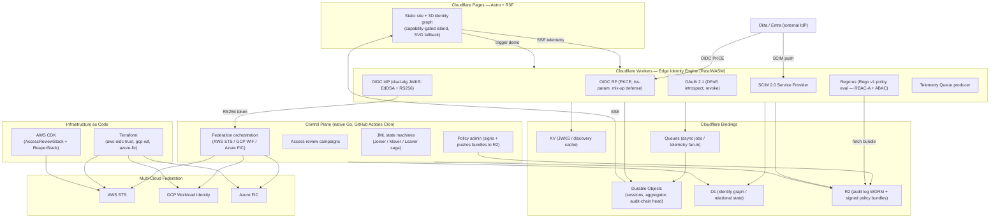

# Tessera — Bespoke Identity Engine

[](https://github.com/burademirung/tessera/actions)
[](LICENSE)
[](https://slsa.dev)
[](https://tessera.degenito.ai)

**A fully working identity engine and living reference architecture** — OIDC/SAML RP + OIDC IdP, SCIM 2.0, OPA/Regorus policy-as-code, keyless multi-cloud federation, and a real-time 3D telemetry graph. Built on Cloudflare using Rust/WASM, Go, and Astro.

---

## What is Tessera?

Identity engineers are expected to understand a wide stack — protocols (OIDC, OAuth 2.1, SAML, SCIM), policy (OPA/Rego, RBAC-A, ABAC), multi-cloud federation (AWS STS, GCP WIF, Azure FIC), lifecycle management (JML, access reviews, offboarding sagas), and the infrastructure that holds it together (Cloudflare, Terraform, CDK, hardened CI/CD).

Most reference material covers each topic in isolation. Tessera wires them into a single, live, opinionated system — one where every component satisfies a real standard, every design decision traces to a cited research finding, and the whole thing runs on free-tier cloud resources.

**Live demo:** [https://tessera.degenito.ai](https://tessera.degenito.ai) — trigger a real OIDC login with PKCE, watch the token flow through the 3D graph over SSE, then exchange a federated credential into AWS, GCP, and Azure live.

---

## Feature Highlights

- **OIDC Relying Party**: Authorization Code + PKCE (S256, anti-downgrade), RFC 9207 `iss` mix-up defense, state/nonce, dual-IdP (Okta + Entra) with built-in mock for offline/CI
- **OIDC Identity Provider**: publishes `/.well-known/openid-configuration` + JWKS over public HTTPS; dual-algorithm (EdDSA internal, RS256 for cloud federation)
- **OAuth 2.1**: PKCE everywhere, exact redirect-URI matching, no implicit/ROPC, DPoP sender-constraining (RFC 9449), token introspection (RFC 7662), revocation (RFC 7009)
- **SCIM 2.0 Service Provider**: Okta + Entra dual-dialect (case-insensitive `op`, `active` boolean/string, `replace` with/without `path`), CI validator replay, `/Schemas` + `/ResourceTypes` + `/ServiceProviderConfig`
- **Keyless multi-cloud federation**: edge issues per-cloud RS256 tokens → live STS/WIF/FIC exchange into AWS, GCP, and Azure — no static cloud credentials, ~$0 cost
- **Policy-as-code**: Rego v1, RBAC-A (NIST SP 800-162) + ABAC, SoD matrix, `opa test`, Regal lint, conftest on Terraform plan JSON; **Regorus** (pure-Rust Rego) evaluates policy at the edge in-process
- **JML lifecycle**: Joiner birthright provisioning, Mover recalculate-don't-accumulate, Leaver multi-step saga (SCIM disable → OAuth revoke → OIDC Back-Channel Logout → API key revoke)
- **Risk-tiered access reviews**: distributed micro-certification, per-entitlement last-use recommendations, reviewer ≠ grantor reconciliation
- **Live 3D telemetry graph**: Queue → Durable Object aggregator → SSE → R3F `useFrame` animation; capability-gated (SVG fallback for reduced-motion/low-end/no-WebGL)
- **Hardened CI/CD**: SHA-pinned actions, keyless OIDC to AWS/GCP/Azure, SLSA L2 provenance, Syft SBOM, Grype/Trivy scan, per-PR ephemeral environments, tag-scoped reaper

---

## Technology Stack

| Requirement | How It Is Satisfied |
|---|---|
| **Go** | Native idiomatic Go control-plane orchestrator (real AWS/Azure/GCP SDKs) run as GitHub Actions Cron + locally |
| **Rust** | Edge identity engine compiled to WASM (`workers-rs`), runs on Cloudflare Workers |
| **Terraform** | Three per-cloud modules provisioning real OIDC federation trust in AWS, Azure, and GCP |
| **AWS CDK** | TypeScript app provisioning the `AccessReviewStack` (EventBridge → Step Functions → DynamoDB) alongside Terraform |
| **SAML / OIDC** | OIDC-first RP (Okta/Entra); SAML brokered via proxy (no unsafe WASM XML-DSig); engine also a real OIDC IdP |
| **SCIM / OAuth** | SCIM 2.0 service provider (Rust edge) passing Okta + Entra validators; OAuth 2.1 + PKCE + DPoP + introspection |
| **AWS / Azure / GCP** | Live keyless federation into all three via OIDC trust + short-lived token exchange — ephemeral, free-tier |
| **OPA** | Rego v1 RBAC-A + ABAC, `opa test`, conftest on Terraform plans; **Regorus** (pure-Rust Rego) runs at the edge |
| **CI/CD** | SHA-pinned GitHub Actions, keyless OIDC, SLSA provenance, SBOM, ephemeral demo environments, drift detection |
| **RBAC / ABAC / policy-as-code** | Role-centric RBAC-A (NIST INCITS 359 + SP 800-162); SoD matrix; ABAC only narrows role envelope |
| **Provisioning / access reviews / offboarding** | JML state machines; risk-tiered review campaigns; multi-step offboarding saga |

---

## Architecture Overview



---

## Repository Layout

| Directory | Purpose |
|---|---|
| `edge/` | Rust/WASM identity engine — OIDC RP/IdP, OAuth 2.1, DPoP, SCIM 2.0, Regorus authz, session DO, telemetry emission |
| `control-plane/` | Native Go orchestrator — JML lifecycle, access-review campaigns, offboarding saga, federation orchestration, policy admin |
| `terraform/` | Multi-cloud OIDC trust modules (`aws-oidc-trust`, `gcp-wif`, `azure-fic`), conftest guardrails, Infracost |
| `cdk/` | AWS CDK TypeScript app — `AccessReviewStack` (EventBridge → Step Functions → DynamoDB), `ReaperStack`, cdk-nag |
| `policy/` | OPA/Rego v1 policies — `authz/` (RBAC-A + SoD), `iac/` (conftest), `conformance/` (Regorus test vectors) |
| `site/` | Astro + R3F frontend on Cloudflare Pages — static-first, 3D identity graph, SSE telemetry, Playwright tests |
| `bootstrap/` | One-time Terraform for CI deploy identities (GitHub-to-cloud OIDC roles; chicken-and-egg) |
| `docs/` | All documentation — architecture, deployment, ADRs, component READMEs, standards, API, operations |

---

## Quickstart

### Prerequisites

| Tool | Version | Used by |
|---|---|---|
| Rust + `wasm-pack` | stable + latest | `edge/` |
| `wrangler` | ≥ 3.x (pinned in CI) | `edge/`, `site/` |
| Go | ≥ 1.23 | `control-plane/` |
| Node.js | ≥ 22 LTS | `site/`, `cdk/` |
| OPA | ≥ 1.0 | `policy/` |
| Terraform | ≥ 1.11 | `terraform/`, `bootstrap/` |
| AWS CLI / Azure CLI / `gcloud` | latest | `control-plane/`, federation |

### Build the Edge Engine

```bash
cd edge
cargo test                        # unit tests (native)
cargo build --target wasm32-unknown-unknown  # WASM build
wrangler dev                      # local Worker dev server
```

### Build and Test Policy

```bash
cd policy
opa fmt --rego-v1 --diff authz/   # Rego v1 format check
opa check --strict authz/         # strict lint
opa test --coverage authz/ conformance/
make conformance                  # run Regorus vector harness
```

### Build the Control Plane

```bash
cd control-plane
go test ./...
go build ./cmd/access-review/...
go build ./cmd/offboard/...
```

### Build the CDK Stack

```bash
cd cdk
npm ci
npm test                          # Jest snapshot + assertion tests
npx cdk synth                     # synthesize CloudFormation
```

### Validate Terraform

```bash
cd terraform
terraform fmt -check -recursive
terraform validate
terraform test                    # mock_provider unit tests
conftest verify policy/           # conftest unit tests
conftest test --policy policy/ <(terraform show -json plan.tfplan)
```

### Run the Site

```bash
cd site
npm ci
npm run build
wrangler pages dev ./dist         # local preview
npm run test:e2e                  # Playwright tests
```

---

## Deploy

See [docs/DEPLOYMENT.md](docs/DEPLOYMENT.md) for the full deployment guide, including:

- Bootstrapping CI deploy identities (`bootstrap/`)
- Setting Cloudflare and cloud secrets in GitHub Environments
- Ephemeral PR environments and teardown
- Production release workflow with SLSA attestation verification
- Tag-scoped reaper configuration

---

## Standards Implemented

Tessera implements or directly exercises the following standards and specifications:

- **OIDC Core 1.0**, **OAuth 2.0 (RFC 6749)**, **OAuth 2.1** (draft), **PKCE (RFC 7636)**
- **OAuth Security BCP (RFC 9700)**, **DPoP (RFC 9449)**, **mTLS (RFC 8705)**
- **Issuer parameter (RFC 9207)**, **JWT BCP (RFC 8725)**, **JWT Access Tokens (RFC 9068)**
- **JWK/JWKS (RFC 7517/7638)**, **Introspection (RFC 7662)**, **Revocation (RFC 7009)**
- **OIDC Back-Channel Logout**, **SAML 2.0** (brokered)
- **SCIM 2.0 (RFC 7642/7643/7644)** — Okta + Entra dual-dialect
- **Workload Identity Federation** — AWS, GCP, Azure (keyless)
- **NIST RBAC (INCITS 359)**, **NIST ABAC (SP 800-162)**, **NIST Zero Trust (SP 800-207/207A)**
- **NIST SP 800-53** (AC/AU/PS families), **ISO 27001:2022** (§5.15–5.18)
- **OWASP ASVS v5.0**, **OWASP API Security Top 10**
- **SLSA v1.x** (provenance attestation), **Rego v1 / OPA 1.0**, **WCAG 2.2 AA**

---

## Testing Summary

| Layer | Test approach |
|---|---|
| Edge (Rust) | `cargo test` (native), `wrangler dev` integration, CI SCIM validator replay (Okta + Entra payloads) |
| Policy (Rego) | `opa test --coverage`, Regal lint, Regorus conformance vector harness, `conftest verify` |
| Control plane (Go) | `go test ./...`, `govulncheck`, integration tests against D1/DO via edge API |
| IaC (Terraform) | `terraform test` with `mock_provider`, `tflint`, `trivy config`, Infracost |
| IaC (CDK) | Jest snapshot tests + fine-grained assertions, `cdk-nag` |
| Site (Astro + R3F) | Vitest unit tests, Playwright E2E (a11y axe WCAG 2.2 AA, Lighthouse ≥ 95) |
| CI/CD | `actionlint`, `zizmor`, gitleaks, SBOM + Grype scan, SLSA provenance verification |

---

## Built by

**Vladimir Kamenev**
- Email: [burademirung@gmail.com](mailto:burademirung@gmail.com)
- Phone: 512 336-9618
- Repository: [github.com/burademirung/tessera](https://github.com/burademirung/tessera)
- Live demo: [https://tessera.degenito.ai](https://tessera.degenito.ai)

---

## License

MIT License — see [LICENSE](LICENSE).
